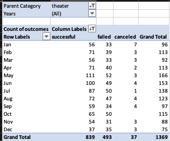
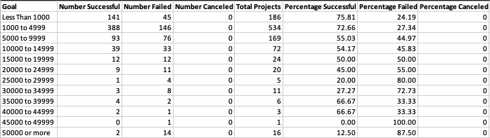

# kickstarter-analysis
Performing analysis on Kickstarter data to uncover trends 

# Kickstarting with Excel

## Overview of Project

### Purpose

Louise is using Kickstarter to fundraise for her play, *Fever*.  She wants to know if there are specific factors that make a project campaign successful. To look for hidden trends, an analysis was performed on data from thousands of crowd funding campaigns that have been held on Kickstarter. As Louise is approaching her goal, she has become interested in how campaign outcomes are related to their fundraising goals and launch dates. Visualizations were made to determine if there are correlations between these factors. 

## Analysis and Challenges

### Analysis of Outcomes Based on Launch Date
The first analysis was done to determine how project outcomes were related to their launch date. In order to perform this analysis, the launch dates in the raw data needed to be converted to a readable format from their Unix timestamps. This was done by creating a new column, column S, in the spreadsheet and applying the following formula.
===(((K2/60)/60)/24)+DATE(1970,1,1)==
Next, the YEAR() function was used to extract the just the year from the date created. All of the data was then selected to create a pivot table. 
 
The pivot table could then be used to create a pivot chart. A line chart was made to easily visualize trends in successful, failed, and canceled campaigns relative to time of the year. 

### Analysis of Outcomes Based on Goals
The next analysis was executed to look for trends in outcomes based on the project's fundraising goal. First a table was created with rows as goal ranges. Columns showed the number of successful, failed, canceled and total projects. the COUNTIFS= function was used to only count projects that met criteria. For example, there were 93 successful campaigns for plays that had a fundraising goal between $5000 and $9999. This number was found using the following equation:
 
These counts were then used to determine percentages of successful, failed, and canceled projects, as seen in the below table. 

Outcome percentages and goal ranges were then used to create a visualization. 

### Challenges and Difficulties Encountered
In this challenge most of the difficulties I encountered were due to typos. For example, on in the Outcomes Bases on Goals spreadsheet I has mistyped 'successful' in the equations in column B. However, I quickly noticed that the numbers I was getting did not make sense, so I knew to go back and review my equations and was able to eliminate the typo. I also ran into a challenge when the graph made for Outcomes based on Goal did not match the example. I was able to determine I was missing a data point. To solve this, I inserted a row into my table for the 30000 to 34999 range, which I accidentally missed the first time.  

## Results

### Campaign outcomes based on launch date
1. Based on analysis done on project outcomes based on launch dates it has been found that successful campaigns peak in May. Therefore, this is the recommended time to launch a Kickstarter campaign. 
2. However, there is little change in the number of failed campaigns from month to month, which suggests that there are factors other than launch date that affect the outcome of a campaign. Furthermore, the launch date has little correlation with failed campaigns. 
### Campaign outcomes based on goals
1. Overall there is greatest chance of a successful campaign at lowest goal amounts. Campaign success and goal amount seem to have an inverse relationship. However, there is a spike in campaign success to about 66% at the goal ranges of 35000 to 45000. 
   
### Dataset limitations
One potential limitation of this data set is that the most recent data points are from 2017. Since this time there has been a global pandemic which may have effected fundraising. It could also heavily effect fundraising for events such as plays that may have to be canceled due to CDC guidelines about covid. 

### Recommendations for further analysis
A box and whisker plot could be created for the subcategory 'plays' data to determine if the spike in campaign success by goal is due to any outliers. An analysis could also be done to look for trends between length of campaign and campaign outcome. This could be useful information for Louise, as an ideal campaign length could be recommended. 
Louise also had an interest in putting on a musical in Great Britain. However, since she does not have experience with musicals in there it could also be beneficial for her to do an analysis comparing results of campaigns for musicals in Great Britain compared to musical Kickstarter campaigns in the United States.

